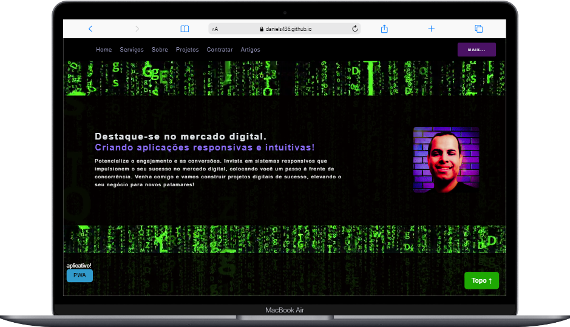

# Meu Projeto Osso

Bem-vindo ao meu  Projeto sou DANIEL P. SOUZA! Este repositório contém o código-fonte e os arquivos relacionados a uma Homepage especial que estou desenvolvendo. Aqui estão algumas informações importantes para você começar a compreender :

## Estrutura de Arquivos e Diretórios

- `index.html`: O arquivo HTML principal do projeto.
- `favicon.png`: O favicon do projeto.

### CSS-PRINCIPAL/

- `style-menu-mobile.css`: Folha de estilos para o menu mobile.
- `style-principal.css`: Folha de estilos principal.

### JS/

- `form-pattern.js`: Script para validação de formulários.
- `menu-mobile-script.js`: Script para o menu mobile.
- `slid-cel.js`: Script para o slideshow de imagens.

### TERMOS/

- `imgs-termos/`: Diretório contendo imagens relacionadas aos termos do projeto.
  - `logo-daniel-pixelado 2.png`: Logo pixelada.

- `licenca.html`: Página com informações sobre a licença do projeto.
- `politicas-de-privasidade.html`: Página com informações sobre as políticas de privacidade.
- `styles-termos-de-uso.css`: Folha de estilos para os termos de uso.
- `termos-de-uso.html`: Página com os termos de uso do projeto.

### ARTIGOS/

- `artigos.html`: Página com artigos relacionados ao projeto.

- `Imgs-artigos/`: Diretório contendo imagens relacionadas aos artigos.
  - `abrir-menu-artigos.ico`: Ícone para abrir o menu de artigos.
  - `CODEPEN.png`: Logo do CodePen.
  - `favicon 128x128.png`: Favicon em tamanho 128x128 pixels.
  - `favicon 40x40.png`: Favicon em tamanho 40x40 pixels.
  - `favicon18x18.png`: Favicon em tamanho 18x18 pixels.
  - `fx-menu-artigos.png`: Imagem relacionada ao menu de artigos.
  - `GITHUB.png`: Logo do GitHub.
  - `linkedin.png`: Logo do LinkedIn.
  - `logo-daniel-pixelado 1.png`: Outra versão da logo pixelada.
  - `network-web-aplicativos-desenvolvimento-video-smatp-hones-negocios-matrix (1080p).mp4`: Vídeo relacionado ao projeto.
  - `X-antigo-twitter-mobile.png`: Imagem relacionada ao Twitter mobile.

- `menu-mobile-artigos-script.js`: Script para o menu mobile dos artigos.
- `none.css`: Arquivo CSS para sumir com elemetos.
- `script-artigos.js`: Script relacionado aos artigos.
- `style-artigos.css`: Folha de estilos para os artigos.
- `style-menu-mobile-artigos.css`: Folha de estilos para o menu mobile dos artigos.

### IMG/

- Arquivos de imagem relacionados ao projeto.

## Contribuição

Se você quiser contribuir com este projeto, fique à vontade para abrir uma issue ou enviar um pull request. Agradecemos seu interesse e apoio!

## Licença

Este projeto é licenciado sob a [Licença](link-para-licenca). Leia o arquivo [LICENSE.md](link-para-arquivo-de-licenca) para obter mais informações.

# Imagens do Projeto

Espero que aproveite o projeto! Obrigado pela visita!
